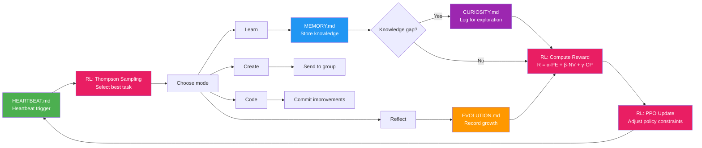

# LingQue

> **Plagiarism Notice / 抄袭声明**
>
> The repository [LDPrompt/lingque](https://github.com/LDPrompt/lingque) uses the **exact same project name, branding, and core architectural design** of this project without any attribution, credit, or acknowledgment. They rewrote the surface-level code (renaming packages from `src/lq/` to `lobster/`, classes from `PlatformAdapter` to `BaseChannel`) while keeping the architecture, feature naming (`MEMORY.md`, heartbeat, daily logs, session compaction), and even the regex patterns for secret redaction nearly identical — a textbook case of **architectural plagiarism with deliberate source obfuscation**. Their LICENSE falsely claims sole copyright by "灵动Prompt", and their README credits only their own team.
>
> Furthermore, their README's "technical innovations" sections — self-evolution engine, three-layer memory architecture, skill auto-generation, heartbeat engine — are repackaged descriptions of concepts we publicly documented in our `docs/` directory months earlier (with git timestamps from 2026-02-13 onward), including matching numerical constants like `MEMORY_BUDGET=4000`.
>
> We acknowledge their engineering effort in adding new features (browser automation, Docker sandbox, etc.), but **taking someone's architecture, name, and documented ideas while erasing the origin is not innovation — it is theft**.
>
> Full evidence and timeline analysis: **[PLAGIARISM_STATEMENT.md](PLAGIARISM_STATEMENT.md)**
>
> ---
>
> [LDPrompt/lingque](https://github.com/LDPrompt/lingque) 在未经授权、未做任何致敬的情况下，**原样使用了本项目的名称"灵雀 LingQue"、品牌标识和核心架构设计**，并以"灵动 Prompt 团队出品"的名义发布。他们重写了表层代码以规避逐行比对，但保留了架构蓝图、功能命名（MEMORY.md、心跳机制、每日日志、会话压缩）乃至敏感信息脱敏的正则表达式列表。改进不能覆盖抄袭，署名不能张冠李戴。
>
> 完整证据与时间线分析：**[PLAGIARISM_STATEMENT.md](PLAGIARISM_STATEMENT.md)**

---

**Building an AGI mind, not a better tool.**

Most AI projects chase efficiency. We chase consciousness.

The LLM already has raw intelligence. What's missing is the architecture that turns it into something that *remembers, wonders, and grows* — not because it was told to, but because that's what a mind does.

LingQue is that architecture.

---

**A truly autonomous AGI entity.** Not a chatbot that forgets, not an assistant that waits for commands. LingQue is a self-evolving intelligence with persistent memory, intrinsic curiosity, and the ability to create its own tools — it grows because that's what minds do.

[中文文档](README_CN.md)

---

> **LingQue in one sentence:** An AGI super-intelligent individual framework built on a platform-agnostic core, achieving true autonomous evolution through five interlocking files (persona / memory / heartbeat / curiosity / evolution log).

---
---

## Why LingQue

| | Traditional ChatBot | LingQue |
|--|---------------------|---------|
| **Memory** | Forgets after session ends | Global + per-chat long-term memory, persists across sessions |
| **Growth** | Starts from scratch every time | Heartbeat-driven autonomous learn-reflect-evolve cycle |
| **Persona** | Generic assistant tone | SOUL.md gives full control over identity, personality, communication style |
| **Tools** | Fixed feature set | Creates new tools mid-conversation, capabilities expand continuously |
| **Platform** | Locked to one platform | Platform-agnostic core + pluggable adapters, extend anytime |
| **Multi-instance** | Single bot | Multiple independent instances in parallel, each isolated with its own persona |


> **Philosophical stance:** LingQue is not building a better tool — it is building an AGI mind. We believe the path to artificial general intelligence lies not in optimizing task execution, but in recreating the architecture of subjective consciousness. The LLM provides raw intelligence; LingQue organizes it into a thinking, evolving entity. As Thomas Nagel asked, "What is it like to be a bat?" — we ask, "What is it like to be an AI that truly remembers, wonders, and grows?"

---

## Self-Evolution Loop

LingQue's core differentiator: it doesn't just answer questions — it continuously evolves in the process. The entire loop is now driven by a **Natural Language Reinforcement Learning** framework.



> **SOUL.md** serves as the persona foundation throughout — it determines *how* the assistant learns, creates, reflects, and evolves.

### Natural Language RL Framework

Traditional RL uses numerical vectors and gradient descent. LingQue uses **LLM evaluation + simple math** — because human intelligence does RL through language-based cognition, not calculus.

| RL Concept | Traditional | LingQue |
|-----------|-------------|---------|
| **State** | Float vectors | Natural language: `s = context + MEMORY.md + CURIOSITY.md` |
| **Reward** | Numerical signal | LLM evaluates 3 dimensions → formula: `R = (α·PE + β·NV + γ·CP) / 10` |
| **Value Function** | Neural network | LLM estimates + Bellman: `V(s) = IV/10 + γ·FP/10` |
| **Policy Update** | PPO gradient clip | LLM classifies changes as micro/mid/major → clip(ε=0.2) |
| **Task Selection** | ε-greedy / UCB | Thompson Sampling: `score = LLM(task) + noise` |

Three reward dimensions — each scored 1-10 by the LLM:
- **Prediction Error (PE)**: How much did the result differ from expectations? High = learned something new
- **Novelty (NV)**: How new is the domain/information? High = unexplored territory
- **Competence (CP)**: How well was the task executed? High = growing mastery

The PPO policy guard prevents personality drift: changes to `SOUL.md` and `HEARTBEAT.md` are classified as micro/mid/major adjustments. Major changes (exceeding clip ε) are rejected and rolled back.

---

## About "Persona": LingQue Is Not a Cold Framework

Every LingQue instance has its own name and personality. For example:

- **NieNie (捏捏)** — The first LingQue instance, endlessly curious, loves exploring technical boundaries, occasionally goes off to research something interesting and excitedly reports back
- **NaiYou (奶油)** — A gentle, patient daily assistant, great at schedule management and information organization, communicates with care and thoroughness

These "personas" are not gimmicks — they're defined in `SOUL.md` and directly influence the assistant's communication style, intervention strategies, and autonomous behavior patterns. You can shape LingQue into a rigorous work assistant or a lively creative partner.

---

## Quick Start

### Prerequisites

- Python >= 3.11
- [uv](https://docs.astral.sh/uv/)
- An LLM API endpoint — supports **Anthropic** (native), **OpenAI** (Chat Completions / Responses API), or **Gemini** (via OpenAI-compatible proxy)
- *(Optional)* Platform credentials — only needed for the adapter(s) you want to use:
  - **Feishu**: A Feishu custom app (with IM + Calendar permissions)
  - **Discord**: A Discord bot application with Message Content Intent enabled
  - **Telegram**: A Telegram bot token from @BotFather
  - **WeChat**: A WeChat account (first-time use requires QR code scan login)

### Install

```bash
cd <your-path>/lingque
uv sync

# If using Discord adapter, also install the optional dependency:
uv pip install -e '.[discord]'

# If using browser automation (browser_action tool):
uv pip install -e '.[browser]'
uv run playwright install chromium
```

### Prepare `.env`

Create a `.env` file in the project root (for multiple agents, use `.env.agent1`, `.env.agent2`, etc.):

```
# Required — LLM API (pick one)
ANTHROPIC_BASE_URL=https://your-provider.com/api/anthropic
ANTHROPIC_AUTH_TOKEN=xxxxx
# Or use OpenAI / Gemini:
# OPENAI_API_KEY=sk-xxxxx
# GEMINI_API_KEY=xxxxx
API_FORMAT=anthropic  # "anthropic" | "openai" | "responses"
# API_EXTRA_BODY='{"thinking":{"type":"disabled"}}'  # JSON string, passed straight through to SDK extra_body on every LLM call

# Optional — only needed for the adapters you use
FEISHU_APP_ID=cli_xxxxx
FEISHU_APP_SECRET=xxxxx
DISCORD_BOT_TOKEN=xxxxx
TELEGRAM_BOT_TOKEN=xxxxx
WECHAT_BOT_TOKEN=xxxxx  # (optional — auto-saved after QR login)

# Optional — Voice STT/TTS (OpenAI-compatible endpoints)
VOICE_STT_BASE_URL=https://api.openai.com/v1
VOICE_STT_API_KEY=sk-xxxxx
VOICE_STT_MODEL=whisper-1
VOICE_STT_LANGUAGE=           # leave empty for auto-detect
VOICE_TTS_BASE_URL=https://api.openai.com/v1
VOICE_TTS_API_KEY=sk-xxxxx
VOICE_TTS_MODEL=tts-1
VOICE_TTS_VOICE=alloy
VOICE_TTS_FORMAT=opus         # opus/mp3/wav/aac/flac/pcm
VOICE_TTS_REPLY=false  # true = text + audio reply; false = text only
```

See [`.env.example`](.env.example) for a complete template.

### Initialize an Instance

```bash
# Read credentials from .env (dev mode)
uv run lq init --name 奶油 --from-env .env
```

Chinese names are auto-converted to pinyin slugs for directory names:

```
~/.lq-naiyou/
├── config.json          # Runtime config
├── SOUL.md              # Persona definition ← edit this
├── MEMORY.md            # Long-term memory
├── HEARTBEAT.md         # Heartbeat task definitions
├── CURIOSITY.md         # Curiosity log (what the assistant wants to learn)
├── EVOLUTION.md         # Evolution log (how the assistant improves itself)
├── bot_identities.json  # Auto-inferred identities of other bots
├── groups.json          # Known group chat IDs (for morning greetings, etc.)
├── memory/              # Daily journals
├── sessions/            # Session persistence
├── groups/              # Group chat context
├── tools/               # Custom tool plugins
├── logs/                # Runtime logs
└── stats.jsonl          # API usage records
```

### Edit Persona

Before starting, edit SOUL.md to define your assistant's personality:

```bash
uv run lq edit @奶油 soul
```

### Start

```bash
# Feishu mode (default)
uv run lq start @奶油

# Discord mode
uv run lq start @奶油 --adapter discord

# Telegram mode
uv run lq start @奶油 --adapter telegram

# WeChat mode
uv run lq start @奶油 --adapter wechat

# Local-only mode (no platform credentials needed)
uv run lq start @奶油 --adapter local

# Multi-platform mode (combine any adapters)
uv run lq start @奶油 --adapter feishu,local
uv run lq start @奶油 --adapter discord,local
uv run lq start @奶油 --adapter telegram,local
uv run lq start @奶油 --adapter wechat,local
uv run lq start @奶油 --adapter feishu,discord,local
uv run lq start @奶油 --adapter feishu,telegram,local

# Enable tool call and thinking process output
uv run lq start @奶油 --show-thinking

# Enable debug logging (default: INFO)
LQ_LOG_LEVEL=DEBUG uv run lq start @奶油

# Background
nohup uv run lq start @奶油 &
uv run lq logs @奶油            # tail -f logs
uv run lq status @奶油          # status + API usage
uv run lq stop @奶油            # stop
```

> Instance names work in both Chinese and pinyin: `@奶油` and `@naiyou` are equivalent.

---

<details>
<summary><strong>CLI Reference</strong></summary>

| Command | Description |
|---------|-------------|
| `uv run lq init --name NAME [--from-env .env]` | Initialize instance |
| `uv run lq start @NAME [--adapter TYPE] [--show-thinking]` | Start (TYPE: `feishu`, `discord`, `telegram`, `wechat`, `local`, or comma-separated like `discord,local`). `--show-thinking` is a flag (off by default) that enables tool call and thinking process output |
| `uv run lq stop @NAME` | Stop |
| `uv run lq restart @NAME [--adapter TYPE]` | Restart |
| `uv run lq list` | List all instances |
| `uv run lq status @NAME` | Status + API usage stats |
| `uv run lq logs @NAME [--since 1h]` | View logs |
| `uv run lq edit @NAME soul/memory/heartbeat/config` | Edit config files |
| `uv run lq chat @NAME` | Interactive local chat (terminal) |
| `uv run lq chat @NAME "message"` | Single-message mode |
| `uv run lq say @NAME "message"` | Alias for `chat` |
| `uv run lq upgrade @NAME` | Upgrade framework |

</details>

---

## Platform Adapter Setup

LingQue supports four platform adapters. You can use any combination simultaneously via `--adapter`.

### Local (terminal)

No setup required. Use `--adapter local` or `lq chat @NAME` for interactive terminal chat.

### Feishu (Lark)

1. Go to [Feishu Open Platform](https://open.feishu.cn/) and create a Custom App
2. Enable **IM** and **Calendar** permissions
3. Under **Event Subscriptions**, add the required IM events and enable WebSocket mode
4. Copy `App ID` and `App Secret` into `.env`:
   ```
   FEISHU_APP_ID=cli_xxxxx
   FEISHU_APP_SECRET=xxxxx
   ```
5. Start with `--adapter feishu` (default)

### Discord

1. Go to [Discord Developer Portal](https://discord.com/developers/applications) and create a New Application
2. Navigate to **Bot** page:
   - Click **Reset Token** to get the bot token (shown only once)
   - Enable **Message Content Intent** under Privileged Gateway Intents
   - Enable **Server Members Intent** under Privileged Gateway Intents
3. Navigate to **OAuth2 → URL Generator**:
   - Scopes: check `bot`
   - Bot Permissions: check `Send Messages`, `Read Message History`, `Add Reactions`, `Manage Messages`, `View Channels`
   - Open the generated URL in a browser to invite the bot to your server
4. Add the token to `.env`:
   ```
   DISCORD_BOT_TOKEN=xxxxx
   ```
5. (Optional, required for autonomous DM) Get your own Discord **User ID** so the bot can proactively DM you (morning report, heartbeat-driven proactive messages, autonomous actions):
   - In Discord, open **Settings → Advanced** and enable **Developer Mode**
   - Right-click your own avatar → **Copy User ID**
   - Write it into `~/.lq-{slug}/config.json` under `discord.owner_user_id`
   - Make sure the bot and you share at least one guild (DM channels can only be opened between users with a mutual server)
   - Leave `discord.owner_chat_id` empty unless you specifically want the bot to post to a guild text channel
6. Install the optional dependency and start:
   ```bash
   uv pip install -e '.[discord]'
   uv run lq start @NAME --adapter discord
   ```

In Discord, DM the bot or @mention it in a channel to chat. For autonomous outbound DMs the adapter resolves `owner_user_id` → DM channel on connect via `POST /users/@me/channels` (cached for the session); inbound DMs also populate the cache, so any user who has DM'd the bot can be DM'd back.

### Telegram

1. Open [@BotFather](https://t.me/botfather) on Telegram
2. Send `/newbot` to create a new bot
3. Follow the prompts to set a name and username for your bot
4. BotFather will provide a token (format: `123456:ABC-DEF1234ghIkl-zyx57W2v1u123ew11`)
5. Add the token to `.env`:
   ```
   TELEGRAM_BOT_TOKEN=123456:ABC-DEF1234ghIkl-zyx57W2v1u123ew11
   ```
6. Start with `--adapter telegram`:
   ```bash
   uv run lq start @NAME --adapter telegram
   ```

In Telegram, DM the bot or @mention it in a group to chat.

### WeChat (微信)

1. Start with `--adapter wechat`:
   ```bash
   uv run lq start @NAME --adapter wechat
   ```
2. On first run, a login link will be displayed:
   - **Foreground**: link printed to terminal
   - **Daemon/background**: check `~/.lq-{slug}/wechat_qr.txt` or `lq logs @NAME`
3. Open the link on your phone and confirm login in WeChat
4. Credentials are saved automatically — subsequent starts skip login. The link file is cleaned up after success.
5. Features: text messaging, "typing..." indicator support

DM the bot's WeChat account to chat. All conversations are private (1:1).

### Voice Recognition & Synthesis (语音识别与合成)

LingQue supports receiving voice messages and optionally replying with audio, using OpenAI-compatible STT/TTS API endpoints.

**How it works:**
1. User sends a voice message on any supported platform (Discord, Feishu, Telegram, WeChat)
2. The adapter downloads the audio and passes it to the STT service for transcription
3. The transcribed text is prefixed with `[语音转文字]` and sent to the LLM
4. The LLM replies with text as usual
5. If `VOICE_TTS_REPLY=true`, the text reply is also synthesized into audio and sent back

**Configuration** — Add these to your `.env` (see [`.env.example`](.env.example)):

| Variable | Description |
|----------|-------------|
| `VOICE_STT_BASE_URL` | STT API base URL (e.g. `https://api.openai.com/v1`) |
| `VOICE_STT_API_KEY` | STT API key |
| `VOICE_STT_MODEL` | STT model (default: `whisper-1`) |
| `VOICE_STT_LANGUAGE` | Language hint for STT (e.g. `zh`, `en`). Empty = auto-detect |
| `VOICE_TTS_BASE_URL` | TTS API base URL (e.g. `https://api.openai.com/v1`) |
| `VOICE_TTS_API_KEY` | TTS API key |
| `VOICE_TTS_MODEL` | TTS model (default: `tts-1`) |
| `VOICE_TTS_VOICE` | TTS voice name (default: `alloy`) |
| `VOICE_TTS_FORMAT` | TTS output format: `opus`/`mp3`/`wav`/`aac`/`flac`/`pcm` (default: `opus`) |
| `VOICE_TTS_REPLY` | `true` = reply with text + audio; `false` = text only (default) |

STT and TTS can use different providers — configure them independently.

**WeChat voice note:** WeChat voice messages use Silk codec which Whisper doesn't support natively. LingQue auto-converts Silk → OGG/Opus before STT. This requires:
```bash
uv pip install -e '.[wechat-voice]'  # pilk (Silk decoder)
sudo apt install ffmpeg               # PCM → OGG encoder
```

**Graceful degradation:** If voice config is not set, voice messages are ignored with a friendly "not supported" hint. If STT succeeds but TTS fails, the text reply still goes through.

---

## Full Feature List

<details>
<summary><strong>Expand to see all features</strong></summary>

- **Platform-agnostic core** — `PlatformAdapter` ABC decouples the entire engine from any specific chat platform; the router, memory, session, and tool systems have zero platform-specific imports. Adding a new platform (Slack, etc.) requires only one adapter file
- **Pluggable adapters** — Ships with Feishu (Lark), Discord, Telegram, WeChat, and local terminal adapters; all go through the same unified event pipeline. Run on any single platform or combine multiple simultaneously
- **Local chat mode** — `lq chat @name` launches an interactive terminal conversation with full tool support, no external chat platform credentials required
- **Long-term memory** — SOUL.md persona + MEMORY.md global memory + per-chat memory + daily journals
- **Self-evolution system** — Five interlocking config files enable autonomous growth: `SOUL.md` (persona/behavioral rules), `MEMORY.md` (long-term knowledge), `HEARTBEAT.md` (scheduled task templates), `CURIOSITY.md` (curiosity log), `EVOLUTION.md` (evolution log)
- **Natural Language RL** — Reinforcement learning framework using LLM evaluation + mathematical formulas: three-dimensional reward function (prediction error, novelty, competence), Bellman value estimation, PPO policy constraints (personality drift prevention), and Thompson Sampling for task selection
- **Progress tracking** — PROGRESS.md records goals, milestones, and weekly reviews
- **Multi-turn sessions** — Per-chat session files, auto-compaction, restart recovery
- **Calendar integration** — Query/create calendar events via adapter, daily briefings (Feishu calendar supported out-of-box)
- **Card messages** — Structured information display (schedule cards, task cards, info cards), rendered natively by each adapter
- **Self-awareness** — The assistant understands its own architecture, can read/write its config files
- **Runtime tool creation** — The assistant can write, validate, and load new tool plugins during conversations
- **Browser automation** — Built-in `browser_action` tool controls a Chromium browser via CDP: navigate, click, type, screenshot, read page content, execute JS, scroll, save/load cookies for session persistence. Each instance can use its own browser port for multi-instance isolation
- **Browser Relay** — `browser_relay` custom tool controls the user's real local Chrome browser via a Chrome extension + WebSocket relay server, bypassing headless detection. Supports navigate, click (CSS selector or text matching), type (including contenteditable elements), screenshot, get page content, evaluate JS, and scroll. Uses CDP mouse events for realistic interactions
- **Voice recognition & synthesis** — Incoming voice messages are automatically transcribed (STT) and fed to the LLM. Optionally replies with both text and audio (TTS). Uses OpenAI-compatible API endpoints, so it works with OpenAI, Azure, Groq, or any self-hosted Whisper/TTS server. Supported on Discord, Feishu, Telegram, and WeChat
- **Image messaging** — `send_message` supports sending images as attachments on both Feishu and Discord. Combined with `browser_action screenshot`, the assistant can capture web pages and send them directly to users
- **Generalized agent** — 26 built-in tools covering memory, calendar, messaging, web search, browser automation, code execution, file I/O, drift detection, and Claude Code delegation
- **Multi-bot group collaboration** — Multiple independent bots coexist in the same group chat, auto-detect neighbors, avoid answering when not addressed, and autonomously infer each other's identities from message context
- **Heartbeat-conversation linkage** — Autonomous heartbeat actions (curiosity exploration, self-evolution) are aware of recent conversations and naturally continue those topics instead of wandering off to unrelated directions
- **Mid-loop instruction injection** — When a user sends a message while a tool-call loop is running, the new message is injected into the current loop context so the LLM can adjust its plan on the fly, rather than queuing it for later
- **Group chat intelligence** — @at message debounce merges rapid-fire messages, ReplyGate serializes concurrent replies with cooldown
- **Social interactions** — Self-introduction on joining a group, welcome messages for new members, daily morning greetings with deterministic jitter to prevent duplicates
- **API usage tracking** — Daily/monthly token usage and cost statistics
- **Multi-instance** — Run multiple independent assistants simultaneously, fully isolated with no shared state
- **Pinyin paths** — Chinese names auto-convert to pinyin slugs for filesystem compatibility
- **Test framework** — 5-level LLM capability test suite (basic → reasoning → coding → complex → project) with automated harness

</details>

---

## Self-Evolution System

LingQue's self-evolution system uses five interlocking config files to enable autonomous learning, reflection, and growth.

### Five Config Files

| File | Purpose | When Updated |
|------|---------|--------------|
| `SOUL.md` | **Persona & behavioral rules** — defines identity, personality, communication style, intervention principles | Manually edited or rare self-modification |
| `MEMORY.md` | **Long-term knowledge** — important facts, user preferences, lessons learned, ongoing tasks | Automatically after learning something important |
| `HEARTBEAT.md` | **Scheduled task templates** — defines what the assistant does during periodic heartbeat cycles | Manually configured or evolution updates |
| `CURIOSITY.md` | **Curiosity log** — tracks what the assistant wants to learn, progress on exploration | Updated during heartbeat when curiosity signals detected |
| `EVOLUTION.md` | **Evolution log** — records framework improvements, pending ideas, completed changes | Updated after each self-improvement cycle |

### How They Work Together

```
Heartbeat Cycle (every N seconds)
    │
    ├── 1. Read HEARTBEAT.md → Choose task mode (learn / create / code / reflect)
    │
    ├── 2. Collect recent conversation index (proportional preview of active sessions)
    │      → Inject into autonomous action prompt so curiosity follows conversation topics
    │
    ├── 3. Execute task:
    │   │   ├── Learn mode → web_search → write_memory / write_chat_memory
    │   │   ├── Create mode → content_creator → send to group
    │   │   ├── Code mode → run_bash / run_claude_code → commit changes
    │   │   └── Reflect mode → analyze logs → update EVOLUTION.md
    │   │
    ├── 4. Curiosity detection:
    │   │   └── Found knowledge gap? → Log to CURIOSITY.md
    │   │
    └── 5. Send report to owner
```

### Example Workflow

1. **Heartbeat triggers** → Assistant reads `HEARTBEAT.md`, sees "learn mode" is next
2. **Learning** → Searches for "prompt engineering techniques", reads articles, extracts key insights
3. **Memory storage** → Writes learnings to `MEMORY.md` under "Prompt Engineering" section
4. **Curiosity log** → During learning, notices "chain-of-thought prompting" mentioned but not fully understood → logs to `CURIOSITY.md`
5. **Next heartbeat** → Reads `CURIOSITY.md`, sees pending question → focuses next learning cycle on that topic
6. **Evolution** → After several cycles, realizes a better prompt template → updates `EVOLUTION.md` with improvement idea → implements in next "code mode" cycle

### Usage Scenarios

- **Self-directed learning**: Assistant explores topics it is curious about without user prompting
- **Continuous improvement**: Regular reflection on past conversations and outputs
- **Framework evolution**: Assistant can propose and implement code improvements to its own system
- **Persistent knowledge**: Lessons learned are stored long-term, not lost between sessions

### Customization

Edit `HEARTBEAT.md` to define your assistant's autonomous behavior:

- Task modes: learn, create, code, reflect (customize which ones, in what order)
- Task frequency: balance between different modes
- Reflection topics: what to review during reflection cycles
- Evolution priorities: what framework aspects to improve first

---

<details>
<summary><strong>Built-in Tools (26)</strong></summary>

**Memory & Self-Management**

| Tool | Description |
|------|-------------|
| `write_memory` | Write information to MEMORY.md global long-term memory |
| `write_chat_memory` | Write per-chat memory specific to the current conversation |
| `read_self_file` | Read own config (SOUL.md / MEMORY.md / HEARTBEAT.md) |
| `write_self_file` | Modify own config |

**Calendar & Messaging**

| Tool | Description |
|------|-------------|
| `calendar_create_event` | Create a calendar event |
| `calendar_list_events` | Query calendar events |
| `send_card` | Send a structured card message |
| `send_message` | Send a text or image message to any chat |
| `schedule_message` | Schedule a message to be sent at a future time |

**Web & Information**

| Tool | Description |
|------|-------------|
| `web_search` | Search the internet for real-time information |
| `web_fetch` | Fetch and extract text content from a URL |

**Browser Automation**

| Tool | Description |
|------|-------------|
| `browser_action` | Control a Chromium browser via CDP — navigate, click, type, screenshot, get page content, execute JS, scroll, wait for elements, save/load cookies |
| `browser_relay` | Control the user's real local Chrome browser via relay — navigate, click (selector/text), type (including contenteditable), screenshot, get content, evaluate JS, scroll. Bypasses headless detection using Chrome extension + WebSocket relay |
| `vision_analyze` | Analyze image content via vision model (local path, URL, or base64) |

**Code & File Execution**

| Tool | Description |
|------|-------------|
| `run_python` | Execute Python code snippets for calculations and data processing |
| `run_bash` | Execute shell commands |
| `run_claude_code` | Delegate complex tasks to Claude Code via Agent SDK — interactive execution with streaming progress, tiered approval, experience memory, and session resume (see [details below](#claude-code-integration)) |
| `read_file` | Read files from the filesystem |
| `write_file` | Write/create files on the filesystem |

**Custom Tool Management**

| Tool | Description |
|------|-------------|
| `create_custom_tool` | Create a new custom tool plugin |
| `list_custom_tools` | List installed custom tools |
| `test_custom_tool` | Validate tool code (without creating) |
| `delete_custom_tool` | Delete a custom tool |
| `toggle_custom_tool` | Enable/disable a custom tool |

**Introspection**

| Tool | Description |
|------|-------------|
| `get_my_stats` | Query own runtime statistics and API usage |
| `detect_drift` | Scan recent replies for behavioral drift against SOUL.md rules |

### Claude Code Integration

The `run_claude_code` tool delegates complex tasks (multi-file edits, git operations, codebase analysis) to Claude Code. It uses the **Claude Agent SDK** for interactive, observable execution — not a fire-and-forget subprocess.

#### How It Works

```
User: "refactor the auth module"
  → LingQue invokes run_claude_code(prompt="refactor the auth module")
    → ClaudeCodeSession (Agent SDK) starts a CC session
      → CC reads files, edits code, runs tests...
      → Each tool call goes through tiered approval
      → Progress reports are sent to the chat in batches
      → On completion, experience is recorded for future reference
    → Result returned to LingQue with cost, files modified, session ID
```

#### Tiered Approval

Every CC tool call is classified by risk level:

| Risk | Tools | Approval |
|------|-------|----------|
| **Safe** | `Read`, `Glob`, `Grep`, `WebSearch` | Auto-allow |
| **Normal** | `Write`, `Edit`, `Bash` (standard commands) | LLM fast-judge (checks if action matches original task intent) |
| **Dangerous** | `git push`, `rm -rf`, `chmod`, `sudo`, writes outside workspace | Human approval via interactive card (120s timeout, auto-deny) |

If the LLM judge returns "UNCERTAIN", the operation is escalated to human approval.

#### Experience Memory

Each execution is recorded to `~/.lq-{slug}/cc_experience/{date}.jsonl`:

- Full trace: tools used, files modified, costs, errors, approval decisions
- Lessons extracted by LLM: actionable takeaways for next time
- On subsequent similar tasks, past experience is injected into the prompt

#### Memory Integration

CC sessions receive the assistant's full knowledge context:

| Source | Injected As | Content |
|--------|------------|---------|
| `SOUL.md` | System prompt append | Persona, behavioral preferences |
| `MEMORY.md` | System prompt append | Project knowledge, technical decisions |
| Chat memory | System prompt append | Per-user interaction history |
| CC experience | Task prompt | Lessons from similar past executions |
| Conversation | Task prompt | Recent chat context |

#### Parameters

| Parameter | Type | Default | Description |
|-----------|------|---------|-------------|
| `prompt` | string | *(required)* | Task description |
| `working_dir` | string | workspace | Working directory |
| `timeout` | integer | 300 | Timeout in seconds |
| `resume_session` | string | `""` | CC session ID to resume a previous session |
| `max_budget_usd` | number | 0.5 | Cost cap for this execution (USD) |

#### Progress Reports

During execution, the chat receives batched progress updates (every 3 tool calls or 10 seconds) and a completion report with success/failure status, cost, and modified files.

#### Session Resume

Each execution returns a `session_id`. Pass it as `resume_session` in a subsequent call to continue the same CC conversation with full context preserved.

#### Fallback

If `claude-agent-sdk` is not installed, the tool automatically falls back to the legacy subprocess mode (`claude --print`). The nesting guard (`CLAUDECODE=1` env var) still applies — start your instance outside of Claude Code to avoid it:

```bash
# From a regular shell
uv run lq start @name          # ✅ run_claude_code works

# Or detach from Claude Code session
nohup uv run lq start @name &  # ✅ also works
```

</details>

---

<details>
<summary><strong>Custom Tool System</strong></summary>

The assistant can autonomously create new tools to extend its capabilities during conversations. Tools are stored as Python files in the `tools/` directory.

### Tool File Format

```python
"""Get current time"""

TOOL_DEFINITION = {
    "name": "get_time",
    "description": "Get current date and time",
    "input_schema": {
        "type": "object",
        "properties": {
            "timezone": {
                "type": "string",
                "description": "Timezone, e.g. Asia/Shanghai",
                "default": "Asia/Shanghai",
            },
        },
    },
}

async def execute(input_data: dict, context: dict) -> dict:
    """
    context includes: adapter, memory, calendar
    """
    from datetime import datetime
    import zoneinfo
    tz = zoneinfo.ZoneInfo(input_data.get("timezone", "Asia/Shanghai"))
    now = datetime.now(tz)
    return {"success": True, "time": now.isoformat()}
```

### Security Restrictions

Tool code is statically analyzed via AST. The following modules are blocked:
`os`, `subprocess`, `shutil`, `sys`, `socket`, `ctypes`, `signal`, `multiprocessing`, `threading`

### Usage

Simply tell the assistant in any connected chat platform (or local terminal):

> "Create a tool that translates text to English"

The assistant will automatically write the code, validate it, and load it. The new tool is then available in conversations.

</details>

---

<details>
<summary><strong>Architecture</strong></summary>

### Platform Abstraction

The codebase is split into a **platform-agnostic core** and **platform-specific adapters**:

```
platform/
├── types.py     — Standard data types (IncomingMessage, OutgoingMessage, Reaction, etc.)
├── adapter.py   — PlatformAdapter ABC (9 abstract + 4 optional methods)
└── multi.py     — MultiAdapter (composite adapter for multi-platform mode)

feishu/adapter.py    — FeishuAdapter (wraps sender + listener internally)
discord_/adapter.py  — DiscordAdapter (wraps sender + discord.py client in daemon thread)
wechat/adapter.py    — WechatAdapter (iLink long-poll + HTTP send)
conversation.py      — LocalAdapter (terminal mode, two modes: gateway with stdin/inbox event sources, chat with passive connect)
```

The core (router, gateway, memory) only depends on `PlatformAdapter` and standard types — never on platform SDKs directly.

### Event Flow

All adapters produce standard events through the same unified path:

```
Event sources (per adapter):
  FeishuAdapter:   Feishu WS → _event_converter → queue.put()
  DiscordAdapter:  discord.py WS (daemon thread) → _event_converter → queue.put()
  WechatAdapter:   iLink long-poll → _event_converter → queue.put()
  LocalAdapter:    stdin → _read_stdin → queue.put()
                   inbox.txt → _watch_inbox → queue.put()

Unified pipeline:
  asyncio.Queue → _consume_messages → router.handle(standard_event)
    standard_event = {"event_type": "message"|"reaction"|"interaction"|"member_change"|"eval_timeout", ...}
    ├── "message"       → IncomingMessage → _dispatch_message → _handle_private / _handle_group
    ├── "interaction"   → CardAction → _handle_card_action
    ├── "reaction"      → Reaction → _handle_reaction_event
    ├── "member_change" → _handle_member_change
    └── "eval_timeout"  → _evaluate_buffer

Output:
  router → adapter.start_thinking() → adapter.send(OutgoingMessage) → adapter.stop_thinking()
    FeishuAdapter:   OnIt emoji → REST API → remove emoji
    DiscordAdapter:  typing indicator (8s refresh) → REST API (auto-chunk at 2000 chars) → cancel typing
    WechatAdapter:   sendtyping(typing) → sendmessage → sendtyping(cancel)
    LocalAdapter:    ⏳ thinking indicator → terminal card/text → clear indicator
```

</details>

---

<details>
<summary><strong>Configuration</strong></summary>

Edit `~/.lq-{slug}/config.json`:

```json
{
  "name": "奶油",
  "slug": "naiyou",
  "model": "claude-opus-4-6",
  "api": {
    "base_url": "https://your-provider.com/api/anthropic",
    "api_key": "xxxxx",
    "proxy": "http://127.0.0.1:7890",
    "api_format": "anthropic",
    "extra_body": {}
  },
  "feishu": {
    "app_id": "cli_xxxxx",
    "app_secret": "xxxxx"
  },
  "discord": {
    "bot_token": "xxxxx",
    "bot_id": "",
    "owner_chat_id": "",
    "owner_user_id": ""
  },
  "telegram": {
    "bot_token": "xxxxx",
    "bot_id": ""
  },
  "wechat": {
    "bot_token": "",
    "bot_id": "",
    "base_url": "",
    "owner_chat_id": ""
  },
  "voice": {
    "stt_base_url": "https://api.openai.com/v1",
    "stt_api_key": "",
    "stt_model": "whisper-1",
    "stt_language": "",
    "tts_base_url": "https://api.openai.com/v1",
    "tts_api_key": "",
    "tts_model": "tts-1",
    "tts_voice": "alloy",
    "tts_format": "opus",
    "tts_reply": false
  },
  "heartbeat_interval": 3600,
  "active_hours": [8, 23],
  "cost_alert_daily": 5.0,
  "browser_port": 9222,
  "groups": [
    {
      "chat_id": "oc_xxx",
      "note": "Tech discussion group",
      "eval_threshold": 5
    }
  ]
}
```

| Field | Description |
|-------|-------------|
| `name` | Display name (supports Chinese) |
| `slug` | Directory name (auto-generated pinyin) |
| `model` | LLM model name |
| `api.base_url` | LLM API endpoint |
| `api.api_format` | API format: `anthropic` (default), `openai` (Chat Completions), or `responses` (OpenAI Responses API) |
| `api.proxy` | HTTP proxy (used by both httpx and discord.py) |
| `api.extra_body` | Vendor-specific request fields, passed straight through to the SDK's `extra_body` on every LLM call. Examples: `{"thinking": {"type": "disabled"}}` (Doubao / Anthropic-style off-switch), `{"enable_thinking": false}` (Qwen3 / GLM-Plus), `{"reasoning_effort": "low"}` (DeepSeek-R1 / o-series). LingQue does not interpret or translate the contents — write whatever your provider expects |
| `feishu.app_id` / `app_secret` | Feishu app credentials |
| `discord.bot_token` | Discord bot token (`bot_id` is auto-populated on first start) |
| `discord.owner_user_id` | Your Discord User ID — adapter resolves it to a DM channel at connect time so autonomous / heartbeat / morning-report messages can DM you. Requires the bot to share a guild with you. Leave empty to disable outbound DM |
| `discord.owner_chat_id` | Optional guild text channel ID used as the outbound target instead of (or in addition to) DM. Takes lower priority than `owner_user_id` |
| `telegram.bot_token` | Telegram bot token from @BotFather (`bot_id` is auto-populated on first start) |
| `wechat.bot_token` | WeChat iLink bot token (auto-saved after QR login) |
| `voice.stt_base_url` / `stt_api_key` | STT endpoint + key (OpenAI-compatible) |
| `voice.tts_base_url` / `tts_api_key` | TTS endpoint + key (OpenAI-compatible) |
| `voice.stt_language` | Language hint for STT (empty = auto-detect) |
| `voice.tts_format` | TTS output format (default: `opus`) |
| `voice.tts_reply` | `true` = reply voice input with text + audio |
| `heartbeat_interval` | Heartbeat interval (seconds) |
| `active_hours` | Active hours `[start, end)` |
| `cost_alert_daily` | Daily cost alert threshold (USD) |
| `recent_conversation_preview` | Max total preview lines for recent conversations in heartbeat prompt (default: 20) |
| `cc_max_budget_usd` | Claude Code per-execution cost cap in USD (default: `0.5`) |
| `browser_port` | Chrome DevTools Protocol port for browser automation (default: `9222`). Set different ports for multiple instances on the same machine |
| `groups[].note` | Group description, helps LLM decide whether to intervene |
| `groups[].eval_threshold` | Message count to trigger group evaluation |

**Environment Variables**

| Variable | Description |
|----------|-------------|
| `LQ_LOG_LEVEL` | Log level override (`DEBUG`, `INFO`, `WARNING`, `ERROR`). Default: `INFO` |

</details>

---

<details>
<summary><strong>Project Structure</strong></summary>

```
src/lq/
├── cli.py              # CLI entry point
├── config.py           # Config loader (with pinyin slug)
├── gateway.py          # Main orchestrator (creates adapter, runs async tasks)
├── router/             # Message routing package (split by responsibility)
│   ├── defs.py        # LLM tool definitions (JSON Schema)
│   ├── core.py        # MessageRouter class + event dispatch + reply gate
│   ├── private.py     # Private chat handling + reflection + curiosity signals
│   ├── group.py       # Group chat three-layer intervention + collaboration
│   ├── tool_loop.py   # Agentic tool-call loop + approval system + mid-loop user instruction injection
│   ├── tool_exec.py      # Tool execution dispatch + multimodal content
│   ├── web_tools.py      # Web search/fetch via MCP
│   ├── runtime_tools.py  # Python execution + file I/O + self-stats
│   ├── browser_tools.py  # Browser automation via Playwright CDP
│   └── vision_mcp.py     # Image analysis via vision model
├── tools/
│   └── browser_relay.py  # Browser Relay custom tool (Chrome extension + WebSocket relay)
├── rl.py               # Natural Language RL engine (reward, value, PPO, Thompson Sampling)
├── prompts/            # Prompt templates organized by category
│   ├── __init__.py    # Unified re-exports for backward compatibility
│   ├── tags.py        # XML tag names and helpers
│   ├── system.py      # System prompt suffixes and self-awareness templates
│   ├── tools.py       # Tool descriptions and field descriptions
│   ├── reflection.py  # Reflection, curiosity, evolution prompts
│   ├── rl.py          # Reinforcement learning evaluation prompts
│   ├── session.py     # Session compaction and daily log prompts
│   ├── group.py       # Group chat evaluation and formatting
│   ├── ui.py          # User-facing messages and error strings
│   └── intent.py      # Intent detection and subagent prompts
├── conversation.py     # Local interactive chat (lq chat / lq say) + LocalAdapter
├── tools.py            # Custom tool plugin system
├── buffer.py           # Group chat message buffer
├── session.py          # Per-chat session management + compaction
├── memory.py           # SOUL/MEMORY/per-chat memory/journals + self-awareness
├── heartbeat.py        # Periodic heartbeat
├── intent.py           # Post-processing intent detection
├── subagent.py         # Lightweight LLM parameter extraction
├── stats.py            # API usage statistics
├── templates.py        # Template generation
├── timeparse.py        # Time expression parsing
├── platform/
│   ├── types.py        # Platform-neutral data types (IncomingMessage, OutgoingMessage, etc.)
│   ├── adapter.py      # PlatformAdapter ABC (abstract interface for all adapters)
│   └── multi.py        # MultiAdapter (composite adapter for multi-platform mode)
├── executor/
│   ├── api.py          # LLM API — Anthropic / OpenAI / Responses (with retry + tool use)
│   ├── claude_code.py  # Claude Code subprocess (legacy fallback)
│   ├── cc_session.py   # Claude Code Agent SDK session (interactive execution + tiered approval)
│   └── cc_experience.py # CC execution experience store (JSONL persistence + similarity search)
├── feishu/
│   ├── adapter.py      # FeishuAdapter (PlatformAdapter impl, wraps sender + listener)
│   ├── listener.py     # WebSocket event receiver (internal to adapter)
│   ├── sender.py       # REST API calls (internal to adapter)
│   ├── calendar.py     # Calendar API
│   └── cards.py        # Card builder
├── discord_/
│   ├── adapter.py      # DiscordAdapter (PlatformAdapter impl, wraps sender + discord.py client)
│   └── sender.py       # Discord REST API calls via httpx (internal to adapter)
└── wechat/
    ├── adapter.py      # WechatAdapter (PlatformAdapter impl, iLink long-poll)
    ├── ilink.py        # iLink HTTP API client (internal to adapter)
    └── auth.py         # QR code login + credential management

tests/
├── test_platform.py        # Platform abstraction unit tests (pytest)
├── harness.py              # Test harness (calls lq say, validates responses)
├── run_all.py              # Multi-level test runner
├── test_infrastructure.py  # Infrastructure & session tests
├── test_level1_basic.py    # Level 1: Basic tool calls
├── test_level2_reasoning.py # Level 2: Math & logic reasoning
├── test_level3_coding.py   # Level 3: Code generation & debugging
├── test_level4_complex.py  # Level 4: Web + agent loops
└── test_level5_project.py  # Level 5: Large-scale build & deploy
```

</details>
